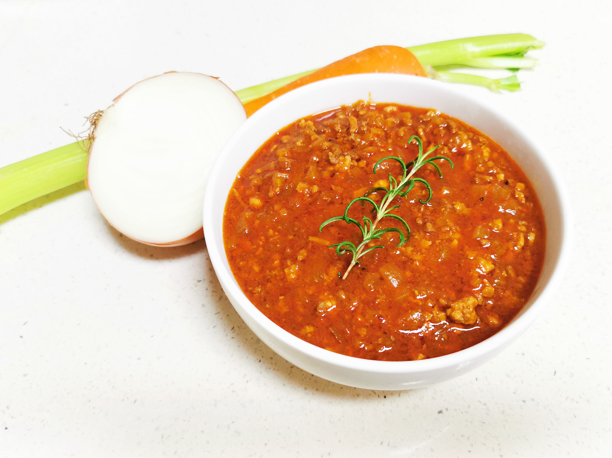

# 子衿的私人厨房 Zijin's Bistro

## 欢迎 Introduction

> 不想做厨师的程序员不是好的秃头怪。——沃·兹基·硕德

欢迎来到子衿的私人厨房！这里记录了一些我的<del>实验记录</del>尝试过的食谱。

## 试试这些菜吧？ Try some featured dishes

- [法式杂菌炖鸡](食在四方/法式杂菌炖鸡.md)

- [勃艮第蘑菇佐以马铃薯泥](食在四方/勃艮第蘑菇佐以马铃薯泥.md)

- [博洛尼亚肉酱](食在四方/博洛尼亚肉酱.md)

