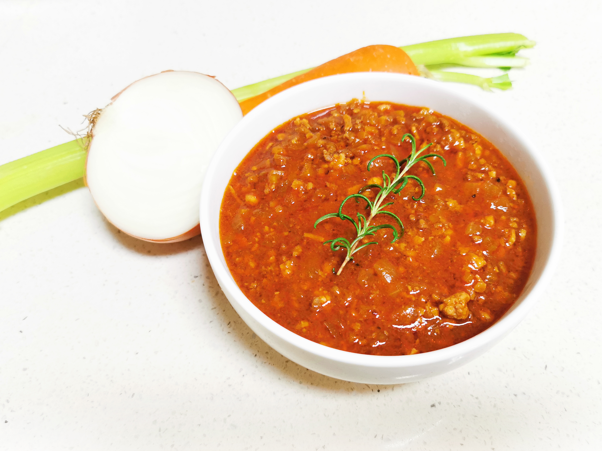

 

# 博洛尼亚肉酱

Ragu alla Bolognese

## 材料

| 3人份                     |              |
| ------------------------- | ------------ |
| 牛绞肉                    | 300g         |
| 猪绞肉                    | 300g         |
| 黄洋葱                    | 1/2个        |
| 胡萝卜                    | 1/2根        |
| 西芹                      | 1根          |
| 培根                      | 2片          |
| 蒜                        | 3瓣          |
| 番茄酱                    | 1罐          |
| 红葡萄酒                  | 100ml        |
| 高汤（或鸡肉/牛肉浓汤宝） | 500ml（1块） |
| 百里香                    | 少许         |
| 迷迭香                    | 1根          |
| 月桂叶                    | 1片          |
| 橄榄油                    | 适量         |

## 做法

1. 准备材料。将洋葱、胡萝卜、西芹切小丁。蒜拍散，切末。培根切碎待用。
2. 取一平底锅，入适量橄榄油，炒香培根。入洋葱，耐心煸炒至发黄变软。倒入蒜末煸香，再入胡萝卜同炒一会。一并盛出。
3. 不要洗锅。锅中重新入油、入绞肉，耐心炒干水分。等锅中油变澄清，将肉拨到一边，在油中倒入番茄酱，稍事炒制以降低酸味。
4. 将所有食材重新混合，淋入红酒，略煮，令酒精蒸发。
5. 入足量高汤、西芹、香草。大火煮开，小火炖煮两小时。
6. 两小时后，捞出香草，以盐和胡椒调味，收汁到合适的浓稠度。
7. 盛盘即食，或密封冷藏、冷冻保存。冷冻以一周为限。

## 注记

- 一锅完成，不要洗锅。记得把番茄酱罐头涮一涮。
- 关于食材：
  1. 一般用烹饪用番茄酱罐头，梅林的就很好；若觉得不够浓郁，可再加少许浓缩番茄膏。不要用番茄沙司。
  2. 当然也可以切一些新鲜番茄进去，前提是你有足够好的。不然只会稀释酱的滋味。
  3. 可加入适量牛奶或淡奶油一同炖煮，味道更佳。
  4. 葡萄酒可以丰富风味，用最便宜的餐酒即可，但最好不要省略。
  5. 也可以选用其它绞肉，乃至加入香肠、肉圆等，都要切碎。
  6. 香料可直接买意大利混合香料Italian seasoning代替，其成分一般有迷迭香、百里香、罗勒、欧芹、月桂等，相当通用。记得买不含辣椒片的。
- 食用方式：
  1. 佐食意面：此酱可直接佐tagliatelle，撒足量帕玛森干酪碎。也可用于lasagna。非常不建议配spaghetti，因面条挂不上酱汁。
  2. 趁热往酱中加入干酪增加稠度，也可作为法棍或蒜香面包片的蘸酱。
  3. 放置隔夜的酱比鲜煮的更好吃。
- 美味的Tips：炒制的时候，按顺序加入食材，每一步炒足够的时间。