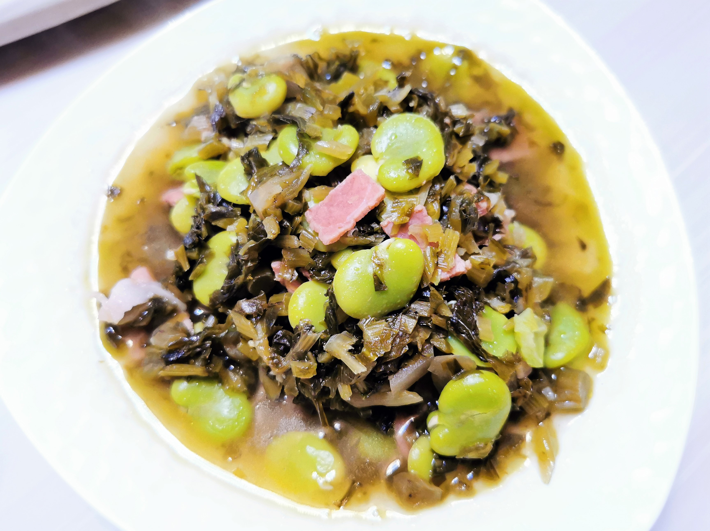

# 咸肉雪菜煨蚕豆

## 材料

| 材料 | 数量 |
| ---- | ---- |
| 蚕豆 | 300g |
| 咸肉 | 30g  |
| 雪菜 | 100g |
| 小葱 | 少许 |
| 姜 | 少许 |

## 做法

1. 蚕豆焯水，过冷河，剥出蚕豆瓣；雪菜切末，咸肉切小片焯水，葱白切末。
2. 起锅煸香葱姜、咸肉、雪菜，入适量盐、少许酱油、白糖、胡椒粉，再投入雪菜一同翻炒。
3. 加少许水，焖至蚕豆酥烂入味，适当收汁，勾薄芡装盘。

## 注记

- 我原以为做这菜不加酱油比较好。测试下来，还是放了少许酱油的版本味道更鲜香。只是需要严格控制加入的量。