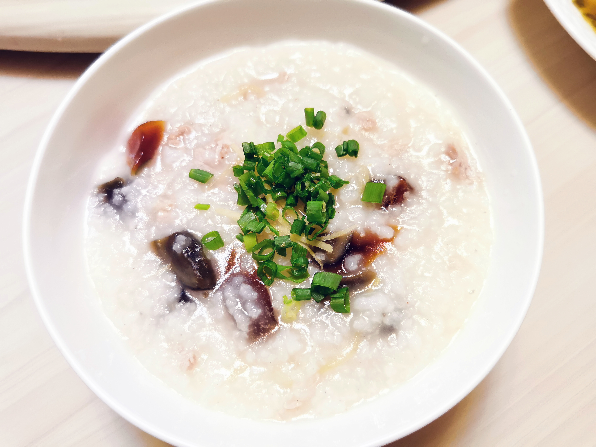

# 家常皮蛋瘦肉粥

这是皮蛋瘦肉粥的家常版本，用电饭煲就能做。

## 材料

| 2人份  |        |
| ------ | ------ |
| 米     | 1/2杯  |
| 猪里脊 | 100克  |
| 皮蛋   | 2枚    |
| 小葱   | 2根    |
| 姜     | 一小块 |

## 做法

1. 淘净米，加水至电饭煲刻度线，煮粥模式煲煮。
2. 准备小料。姜去皮切细丝，葱切葱花。
3. 准备粥料。皮蛋切小块。里脊肉切片，入少许酱油、盐、黄酒、白胡椒粉、姜丝拌匀，封少量食用油。
4. 起锅烧开适量水，约是粥底的1/2。倒入粥底混合略煮，就成浓稠度、火候刚好的粥底。
5. 投入适量姜丝。下里脊肉，用筷子划开。入皮蛋。小火煮10分钟，经常搅拌避免糊锅。
6. 调入适量盐、白胡椒粉。
7. 盛出，撒上葱花，摆几根姜丝点缀。

## 注记

- 这篇菜谱是家常做法，取巧在粥底的准备。用电饭煲可以快捷省心地煮出米粒开花的半成品稠粥，省去看顾炉火的麻烦。再加水稍事调和就可以得到不错的粥底。想更偷懒，可以下入粥料再用煮粥模式煲一次，唯一开始需要加稍多水。
- 米粒也可以先泡过、打碎。
- 封油是里脊肉细嫩的关键。

