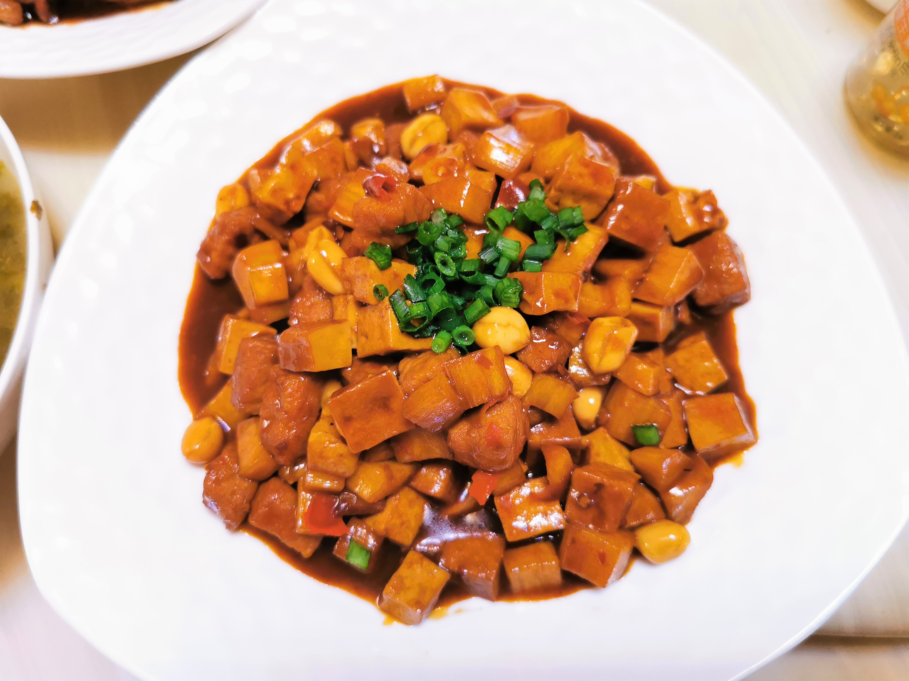

# 本帮家常辣酱

## 材料

| 材料 |  |
| --- | --- |
| 猪瘦肉 | 150克 |
| 豆腐干 | 3块 |
| 茭白 | 2根 |
| 花生米 | 适量 |
| 辣豆瓣酱 | 20克 |
| 黄酒 | 10毫升 |
| 蚝油 | 15毫升 |
| 甜面酱 | 15克 |
| 白糖 | 10克 |
| 老抽 | 5毫升 |
| 生抽 | 10毫升 |
| 淀粉 | 少许 |

## 做法

1. 猪肉切丁，加少许盐、黄酒和淀粉腌制。茭白、豆腐干切丁，焯水。葱切葱末。花生泡开，去皮，起锅炒熟待用。
2. 起锅煸炒肉丁，成熟后盛出。
3. 锅中留少许底油，加入豆瓣酱，炒出红油后放入肉丁、蔬菜丁合炒。
4. 调味。入老抽、蚝油、甜面酱，翻炒均匀。倒入适量水，煮开，小火煮10分钟。
5. 入白糖调味，大火收汁，倒入花生合炒片刻，加水淀粉勾芡。
6. 出锅装盘，撒上葱末点缀。

## 注记

- 「辣酱」是上海地方的说法。其实是一道家常快手的炒菜，由八宝辣酱简化而来。也可以作为面的浇头。
- 辣酱或豆瓣酱为菜肴提供色泽，成菜并不辣。务必耐心炒制辣酱，及至油变红色再继续接下来的步骤。
- 如无茭白，可用笋代替。