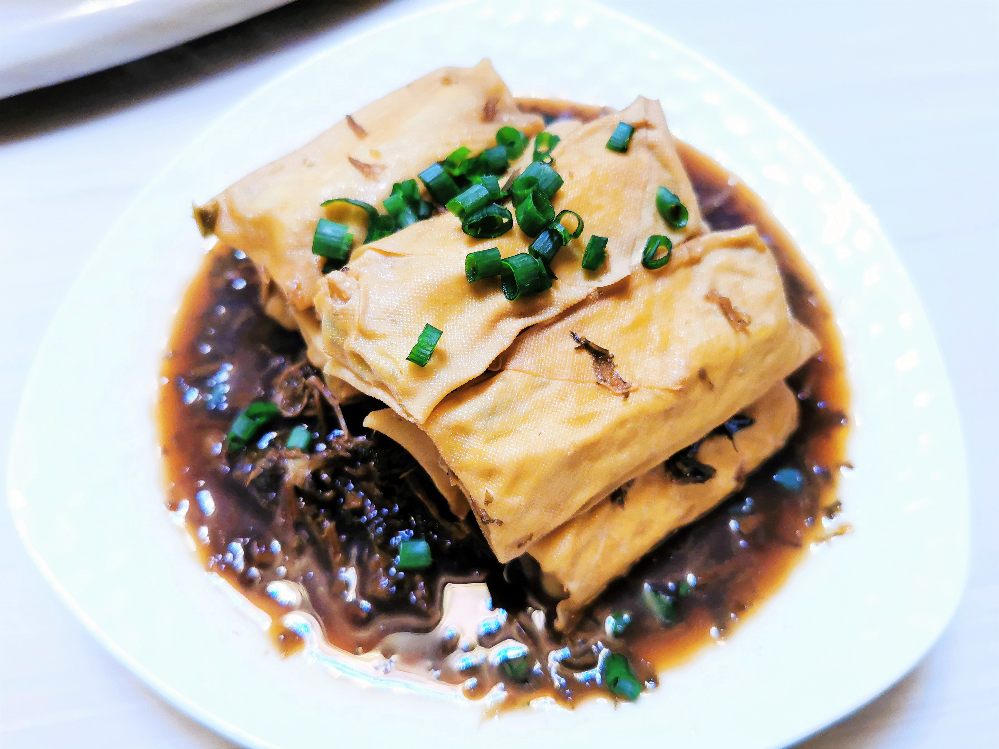

# 梅菜千张

## 材料

| 材料   | 数量 |
| ------ | ---- |
| 梅干菜或笋干菜 | 100g |
| 虾仁   | 10个 |
| 五花肉 | 500g |
| 千张   | 12张 |
| 鸡蛋   | 1枚  |
| 小葱   | 少许 |
| 姜     | 少许 |

## 做法

1. 五花肉去皮切丁剁成馅，入料酒、葱花、姜末、盐调味。
2. 千张切成大方块，入肉馅包成枕头包，以鸡蛋液封口；每个千张包所用肉馅约50克。
3. 将包好的千张包上屉蒸15分钟。
4. 温水泡开梅干菜，依个人喜好切段或切末，入锅煸香，入适量盐、糖、酱油提味；加适量水烹至笋干菜变软、入味。
5. 入千张包和虾仁，再煮约5分钟；收汁出锅。
6. 盛盘。将梅干菜连汤汁垫在盘底，千张包摞在梅干菜上。撒少许葱花点缀。

## 注记

- 笋干菜，即混合了风干笋片的梅干菜。
- 不妨在肉馅里羼一些其他材料，虾仁、干贝、笋干、荠菜都很好，只是都要切碎。也可羼一些卷心菜。