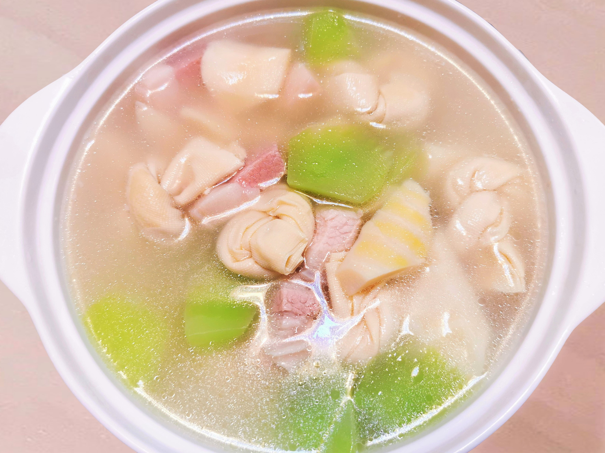

# 腌笃鲜

## 材料

| 材料 |   |
| --- | --- |
| 五花肉 | 150克 |
| 咸肉 | 200克 |
| 火腿 | 50克|
| 春笋 | 3棵 |
| 莴笋 | 1棵 |
| 百叶结 | 适量 |
| 小葱 | 少许 |
| 姜 | 少许 |

## 做法

1. 五花肉、咸肉切小块，火腿切片；焯水，撇去浮沫。
2. 春笋去壳，焯水去除涩味，切滚刀块。
3. 起锅加足以没过食材的水，入五花肉、咸肉、火腿、葱结姜片，水开后中火炖煮1小时。
4. 俟汤汁变成奶白色，再加入百叶结和笋块，炖煮30分钟，拣出葱结姜片，撒上葱花。

## 注记

- 老菜谱中的腌笃鲜不用火腿、莴笋、百叶结；在我们的菜谱里，它们分别用来提鲜、提色、吸附多余的油脂。
- 一些餐厅的出品看上去汤色更奶白，是因为泼了少许猪油。家常做法不妨跳过这一步骤。
- 腌笃鲜一般作为「汤菜」上桌。我们保留了稍多的汤汁，使之成为一道更为清爽的饭后「汤」。可以依个人喜好斟酌水量的多少。