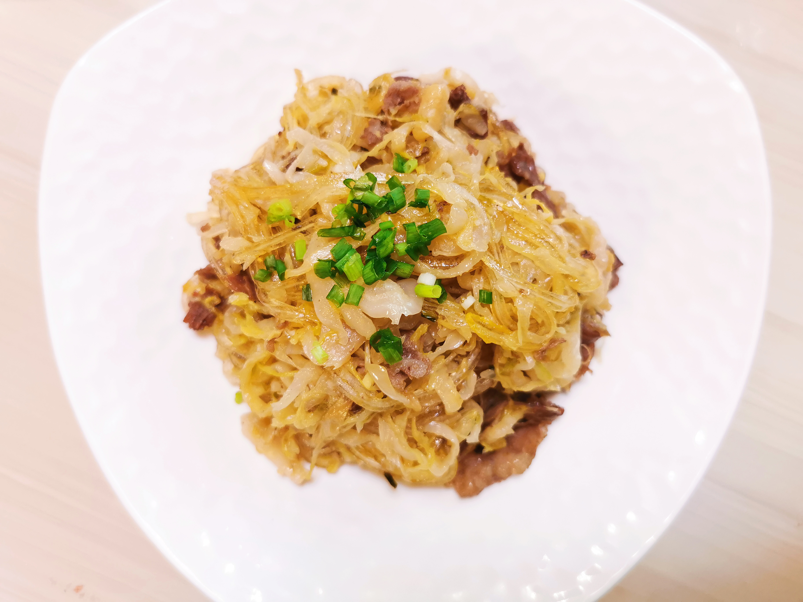

# 酸菜炒粉条

## 材料

| 材料     |      |
| -------- | ---- |
| 东北酸菜 | 500g |
| 粉条     | 100g |
| 牛肉片   | 150g |
| 姜       | 10g  |
| 蒜       | 3瓣  |
| 干辣椒   | 1颗  |
| 小葱     | 1棵  |

## 做法

1. 酸菜用清水冲洗两遍，攥干水分。
2. 姜蒜切米，小葱切葱花，干辣椒剪段待用。粉条用温水泡开。
3. 起锅入稍多油，下葱白、姜、蒜、干辣椒爆香，入牛肉片翻炒。
4. 待牛肉片成熟，依次入酸菜、粉条，充分炒制。加适量酱油、盐，少许糖提味。
5. 盛盘，撒少许葱花点缀。