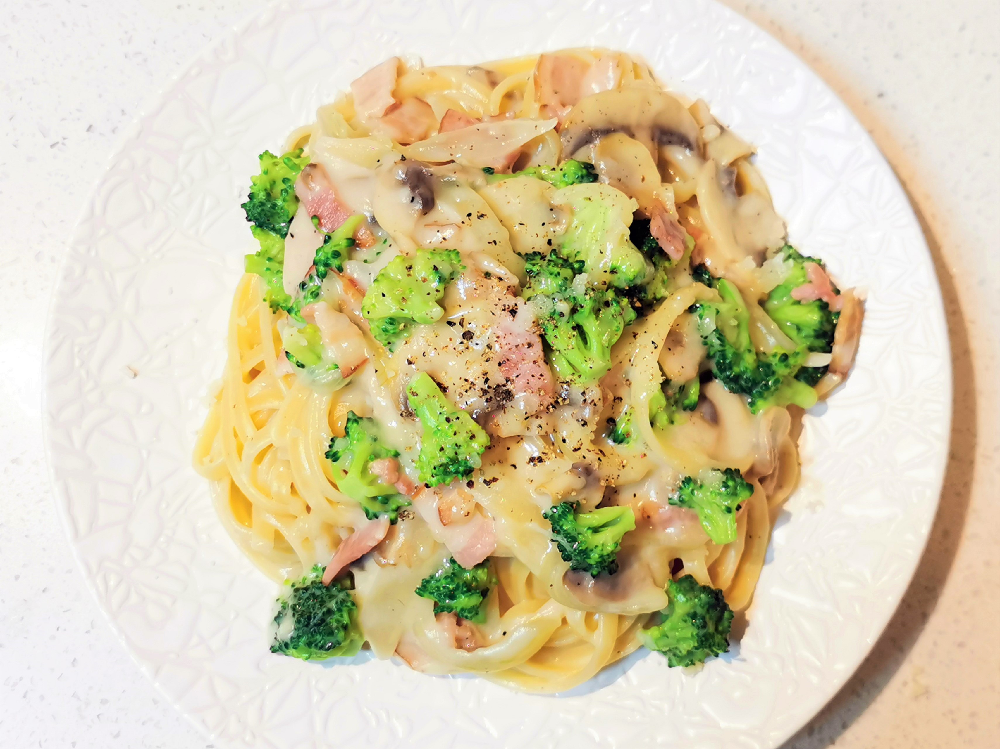

# 培根西兰花意粉

Cheesy broccoli pasta with bechamel sauce

## 材料

| 1人份 |   |
| --- | --- |
| 意大利面（penne） | 120克 |
| 培根 | 2片 |
| 洋葱 | 80克 |
| 蘑菇 | 80克 |
| 西兰花 | 80克 |
| 无盐黄油 | 30克 |
| 蒜 | 1瓣 |
| 面粉 | 20克 |
| 牛奶 | 1杯 |
| 奶酪（parmesan、mozzarella或其它） | 50克 |
| 肉豆蔻 | 少许 |
| 黑胡椒 | 少许 |
| 橄榄油 | 适量 |
| 颗粒芥末酱（可选） | 少许 |
| 欧芹（或罗勒） | 少许 |

## 做法

1. 备料。西兰花取花朵部分切碎，嫩茎部分切小块；蒜切末，洋葱、蘑菇切片，培根切小块待用。
2. 煮面和蔬菜。同一时间，起锅烧开水，加入适量盐，投入面和西兰花。西兰花煮3-5分钟，先行捞出过冷水以保持绿色。面比包装盒上的时间少煮1-2分钟。保留一些煮面水备用。
3. 制作白酱（bechamel sauce）：
	- 锅中融化无盐黄油，倒入面粉，充分混合炒制，去除面粉的生涩味。直到形成质地光滑细腻的油面酱。
	- 倒入一杯冷的全脂牛奶，40克奶酪，搅拌均匀。
	- 撒入适量的盐和黑胡椒粉，并加入一点点磨碎的肉豆蔻。
	- 视个人口味，可以加入1茶匙颗粒芥末酱来丰富口感，也可加入一点百里香。
	- 熬煮10~12分钟，持续搅拌防止粘锅，直至酱料变浓稠。
3. 取平底锅，依次入蒜、洋葱、培根、蘑菇，充分炒制。倒入面和西兰花、充分的白酱。加入几汤匙煮面水，稍加搅拌和炖煮，使面和酱汁融为一体。
4. 盛盘。撒适量黑胡椒和磨碎的奶酪。撒少许罗勒或欧芹碎点缀。

## 注记

- 这是一款快手意面，以经典的 bechamel sauce 为基底。
- 面条最好选用管面 penne，和酱汁最搭。其它面当然也可以。
- 其实最好同时准备好面和酱。但按上文顺序提前煮好面，原本需要用三次锅的菜谱，就可以省一个（乃至两个）锅，方便很多~
- 油面酱务必炒至质地均匀，不然在加入牛奶后会有明显的颗粒感。此时可以过筛来获得光滑的质地。