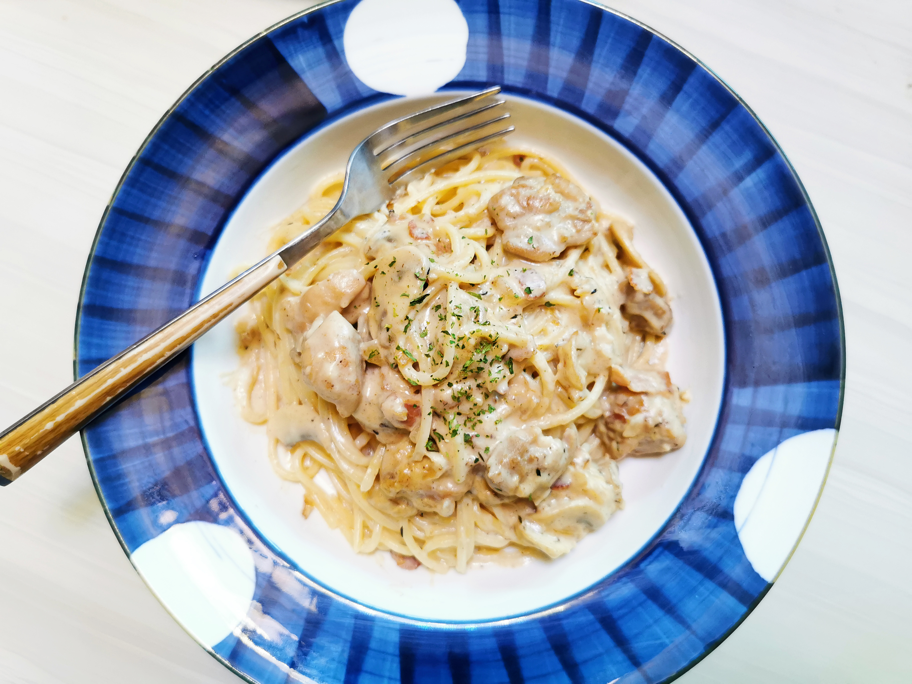

# 奶油蘑菇意面

天气转凉，来做一份温暖浓郁的奶油蘑菇意面吧。做法稍显繁琐，但成功率高，且味道极佳。

## 材料

| 1人份                        |        |
| ---------------------------- | ------ |
| 意面（spaghetti）            | 100克  |
| __用于配料__                 |        |
| 白蘑菇                       | 6枚    |
| 黄洋葱                       | ¼个    |
| 鸡腿肉                       | 80克   |
| 培根                         | 2片    |
| 蒜                           | 2瓣    |
| 白葡萄酒                     | 50毫升 |
| 橄榄油                       | 适量   |
| __用于简易白酱（Béchamel）__ |        |
| 黄油                         | 20克   |
| 面粉                         | 20克   |
| 鲜牛奶                       | 200克  |
| 淡奶                         | 50毫升 |
| 肉豆蔻                       | 少许   |
| 蒜                           | 少许   |
| __用于摆盘装饰__             |        |
| 欧芹                         | 少许   |

## 做法

1. 准备材料。蘑菇切薄片，洋葱、蒜瓣切碎，培根切小块，鸡腿去骨去皮切小块。另将牛奶加热待用。
2. 先炒制配料。取一平底锅，全程大火。倒入适量橄榄油。入鸡肉、培根，炒至鸡肉表面发黄。同时另起一锅，以盐水煮意大利面。煮到喜欢的软硬程度，捞出待用。
3. 入洋葱。待洋葱变软，入蒜末。入蘑菇片，稍事翻炒。加适量盐和黑胡椒调味。充分炒制后，倒入适量白葡萄酒，蒸发酒精。盛出待用。
4. 再来做一份简易白酱。转小火，不要洗锅。炒制油面糊（roux）。在锅中融化黄油，倒入等量面粉，炒至面粉不再具有生涩味。分次入热牛奶，不断搅拌均匀，直到无结块。再加入淡奶。入适量盐、黑胡椒，擦碎少许肉豆蔻调味。至此简易白酱完成。
5. 将配菜倒回锅中。炒匀，略煮，入少许百里香增加风味。
6. 倒入煮好的意面。再加入少许煮面水，将酱汁调至喜欢的浓稠度。略煮两分钟，让面条和酱汁融合。
7. 盛盘，撒上少许欧芹碎点缀。趁热吃。

## 注记

这份面看起来很复杂，其实按照步骤来，没有什么容易失手的地方。一般都能获得满意的出品。

- 关于配菜的处理
  1. 奶油蘑菇意面，一般会加些培根碎丰富口味。也有加入鸡肉的——我们当然是全都要啦。确实效果很棒。你也可以选择自己喜欢的配菜。
  2. 一些食谱会漏掉蒜。其实加一瓣能丰富配菜的味道。对于不喜蒜的人，成品也几乎吃不出蒜味。
  3. 奶油意面味道很浓厚。所以加入“可能使面更腻”的食材时，一定要控制用量。因为炒制油面糊必须用到黄油，所以配菜就换了橄榄油来炒——这是个人看法。
  4. 我觉得白葡萄酒很重要，可以解腻并提升配菜风味，有的话最好来一点。
- 关于简易白酱
  1. 一些食谱会建议，在配菜里直接倒入淡奶，速成一份奶油汁——这样当然也很好。我们费点功夫做了一份白酱，使味道丰富、浓郁很多。
  2. 肉豆蔻一般用nutmeg grater磨碎后使用，磨一点就好。也可以试试家里的磨蒜器。
  3. 白酱里一般多少会放点香料提味。我用了肉豆蔻和百里香，一说用肉桂粉和丁香也很好。没有的话，可以都不加。
  4. 一定要炒匀油面糊再倒入牛奶，一定要用热牛奶——教训啊……
  4. 淡奶很重要，试了一次不放的版本，总觉得缺少奶味（21-12-3）
- 好吃的Tips：
  1. 配菜每步炒够时间真的很重要。
  2. 要仔细调整酱汁的厚度。通常，酱汁在锅内看上去会稍微稀薄一些。但这是奶油酱！略一降温就会迅速凝结成浓稠的质地。如果锅内的酱汁很浓郁，盛盘后很可能变成一坨。

Buon appetito!

