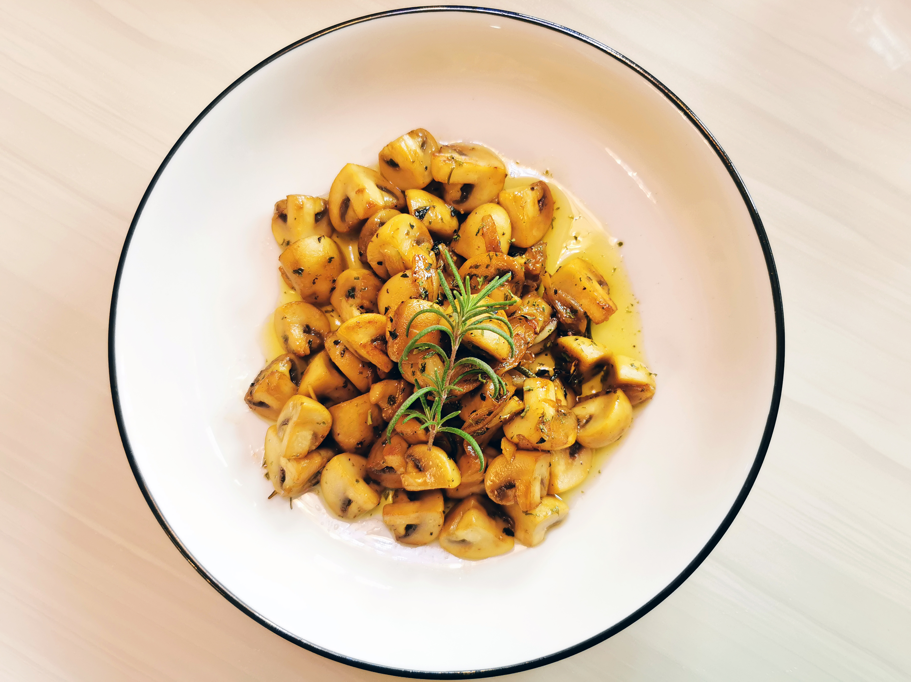

# 蒜油蘑菇

## 材料

| 2人份                 |            |
| --------------------- | ---------- |
| 白蘑菇                | 150克      |
| 蒜                    | 5瓣        |
| 橄榄油                | 20克       |
| 黄油                  | 10克       |
| 白葡萄酒              | 20毫升     |
| 迷迭香                | 少许       |
| 欧芹                  | 少许       |
| 黑胡椒                | 少许       |
| 辣椒片（chili flake） | 可选，少许 |

## 步骤

1. 将蘑菇去蒂，一切四或一切二；蒜切薄片；如用鲜欧芹，切碎待用。
2. 取一平底锅，入黄油、橄榄油。先将蒜片炸出香味，入迷迭香，再入蘑菇炒制。炒至蘑菇发黄且略略缩水，入欧芹碎、盐、胡椒调味，喜辣者可再放少许辣椒片。
3. 淋入少许白葡萄酒去渣，快速翻炒数下收汁。
4. 起菜，摆一支迷迭香点缀。

## 注记

- 橄榄油用量从丰。适宜的油量是在让蘑菇保持油润外，略有盈余。炒过蘑菇的油香味浓郁，多放一些也不会浪费，可以用来蘸面包或者拌意面。黄油的奶香味和蘑菇相宜，但用多则患油腻。
- 这道菜冷吃也不错，可以带去野餐。但不宜放过久，否则蘑菇会进一步失水，失去弹牙的口感。
- 蘑菇不妨炒久一些。

