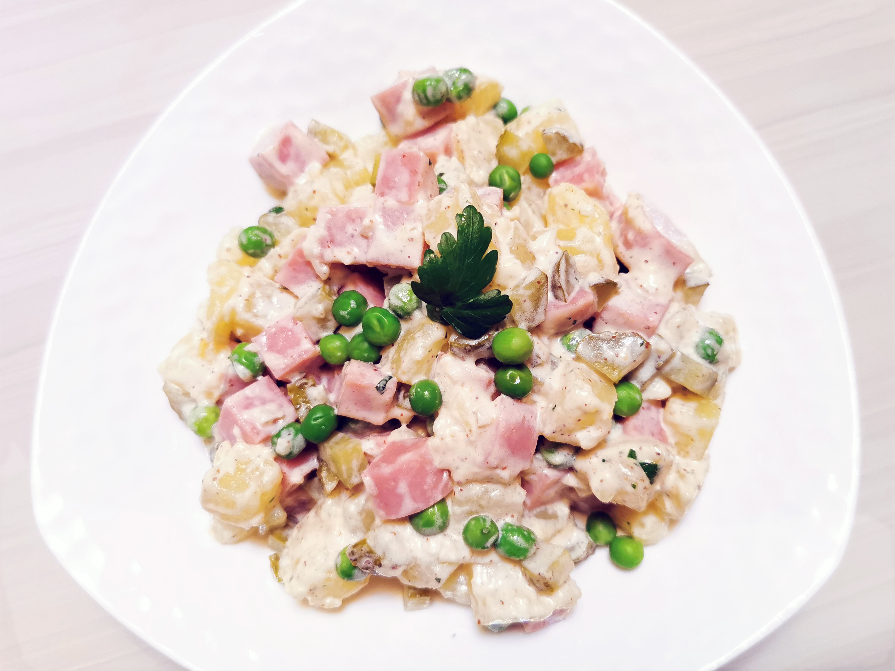

# 海派土豆沙拉

## 材料

| 材料 |   |
| --- | --- |
| 土豆 | 1只 |
| 盐水方腿 | 100克 |
| 青豆 | 2汤匙 |
| 酸黄瓜 | 3根 |
| 洋葱 | 50克 |
| 西芹 | 50克 |
| 蛋黄 | 1枚 |
| 植物油 | 3汤匙 |
| 白醋 | 2茶匙 |
| 糖 | 1茶匙 |
| 第戎芥末酱 | 1汤匙 |
| 酸奶 | 1汤匙 |
| 莳萝 | 少许 |
| 黑胡椒 | 少许 |
| 盐 | 少许 |

## 做法

1. 打发蛋黄酱。蛋黄加糖打发。逐步加入植物油和白醋继续搅打，直至浓稠。
2. 备料。土豆切丁撒少许盐蒸熟。方腿、酸黄瓜切小丁。洋葱、西芹、莳萝切末。青豆煮熟待用。
3. 制作沙拉酱。将蛋黄酱、第戎芥末酱、酸奶、洋葱、西芹、莳萝混合，撒适量盐和黑胡椒，搅拌均匀。
4. 将全部食材以沙拉酱拌匀，即可盛盘。