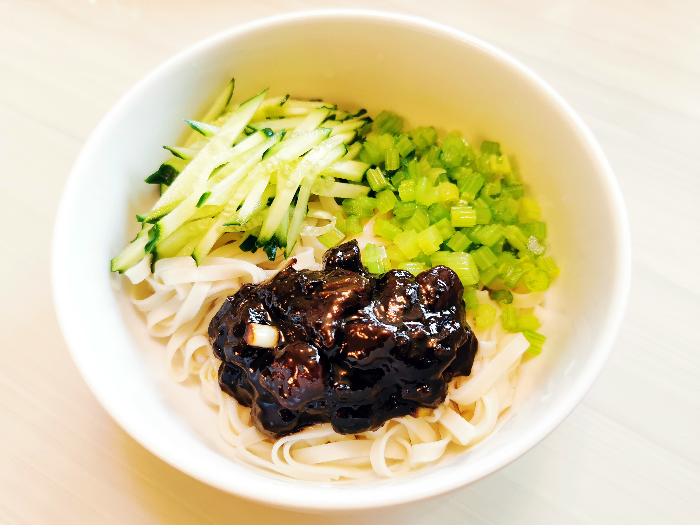

# 老北京炸酱面

## 材料

| 4人份    |       |
| -------- | ----- |
| 五花肉   | 250克 |
| 干黄酱   | 250克 |
| 甜面酱   | 80克  |
| 黄酒     | 80克  |
| 冰糖     | 30克  |
| 大葱     | 100克 |
| 姜       | 30克  |
| 手擀面   | 适量  |
| 时令面码 | 适量  |

## 步骤

- 备料。五花肉去皮，切1厘米见方的丁；可将肥肉单独剔出，或另备一块猪板油，同样切丁。干黄酱入黄酒和等量水，澥开。姜切末，葱切豆瓣葱。
- 炸肉丁。起锅，先入肥肉，花5~7分钟炼出油。再与瘦肉一同煸炒七八分钟。期间以黄酒或白酒去腥，并入适量葱、姜末增香。盛出待用。
- 炸酱。另起一锅，入较充裕的油。先花约10分钟炒制干黄酱，入冰糖，再依次入豆瓣酱、肉丁分别炒制10、15分钟。期间保持小火，并全程搅拌，避免糊底。炒至酱呈现光泽，且油酱分离。关火，入剩下的大葱，用余温将葱焖熟。
- 煮适量面条，以手擀面为佳，家常用挂面也可。备适量面码（常用黄瓜丝、芹菜末、黄豆、心里美萝卜丝等，依个人喜好）。夏天吃过水儿，捞出面条先冷水过凉。大碗盛面，摆上适量面码，两勺炸酱。拌匀趁热吃。

## 注记

- 好的炸酱应当油润有光泽。
- 炸酱时，宁可多放些油。油要烧熟，不然难免有生涩味。如果炒制中感觉酱的质感粘稠干涩，则多半是油太少。
- 干黄酱极易粘锅，焦糊则发苦。务必全程搅拌以避免。
- 使用的甜面酱是京式甜酱，耐炒制，较之江南地方的甜酱是另一种东西。很咸，所以分量较黄酱酌减（笔者以为用黄酱分量的1/3即可）。所用干黄酱和甜面酱均来自六必居，一说天源酱园所出也很好，网购易得。
- 冰糖是为了酌减干黄酱的苦味，大胆放，成品并不犯甜。