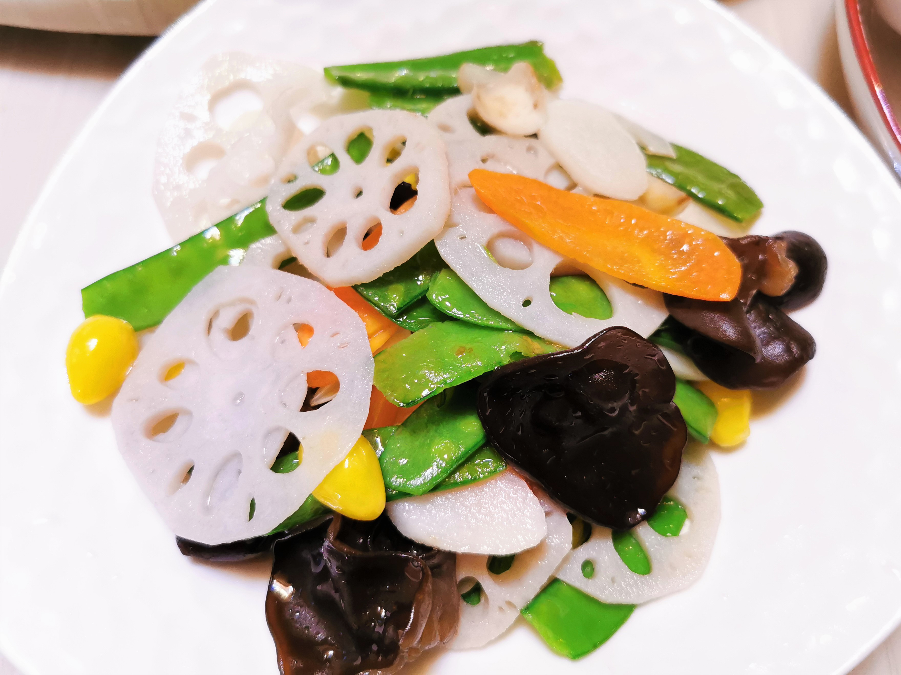

# 荷塘小炒

## 材料

| 材料 |   |
| --- | --- |
| 荷兰豆 | 80克 |
| 莲藕 | 50克 |
| 木耳 | 50克 |
| 胡萝卜 | 50克 |
| 白果 | 10克 |
| 百合 | 10克 |
| 蒜 | 1瓣 |

## 做法

1. 荷兰豆掐头去尾。莲藕切片，胡萝卜切菱形片待用。白果、木耳、百合若用干货，需提前泡发。蒜切片。
2. 白果焯水至全熟。
3. 入其它蔬菜略焯水，快速捞出，过冷河。
4. 起锅入少许油，爆香蒜片。入蔬菜快速翻炒几下，加少许盐调味。